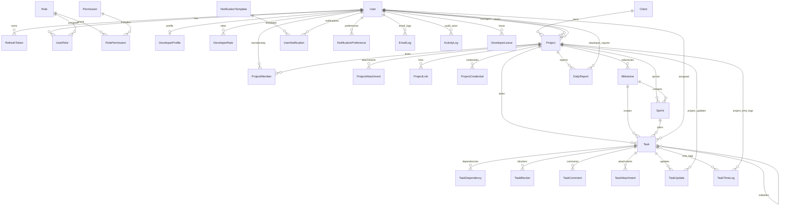

# ER Diagram And Database Documentation

## Mermaid ER Diagram

## Table Groups

### Authentication And RBAC

- `users`: identity, status, soft delete, profile entry point.
- `refreshTokens`: hashed refresh tokens, token family tracking, rotation/revocation.
- `roles`, `permissions`: system and custom access-control records.
- `userRoles`, `rolePermissions`: role assignment and permission mapping junctions.

### Project Delivery

- `clients`: client account and contact data.
- `projects`: project brief, schedule, budget, status, ownership, URLs, and stack JSON.
- `projectMembers`: project team roster with role and allocation.
- `projectAttachments`, `projectLinks`, `projectCredentials`: project documentation, URLs, and encrypted secrets.
- `milestones`, `sprints`, `tasks`: delivery planning hierarchy.
- `taskDependencies`, `taskBlockers`, `taskComments`, `taskAttachments`: task collaboration metadata.

### Reporting And Costing

- `taskUpdates`: daily developer updates with status/progress movement.
- `taskTimeLogs`: work logs by developer, project, task, and date.
- `dailyReports`: generated developer/project/date summaries.
- `developerRates`: effective-dated cost and billing rates.

### Notifications, Jobs, Audit

- `notificationTemplates`, `userNotifications`, `notificationPreferences`, `emailLogs`: notification and email system.
- `backgroundJobRuns`: job execution history.
- `activityLogs`: audit trail for domain activity.

### Calendar And Availability

- `calendarEvents`: manually created meetings and other calendar records.
- `developerLeaves`: developer leave requests and approvals.
- `holidays`: company or regional holiday calendar.

### Masters

- `currencyMasters`: currencies used by project budgets.
- `technologyStackMasters`: reusable stack choices for projects.

## Index Strategy

- Every major soft-deleted table indexes `deletedAt` and/or `isActive`.
- Foreign keys used for route lookups are indexed, including project, task, user, milestone, sprint, notification, and activity dimensions.
- Reporting-heavy tables index date fields such as `dueDate`, `updateDate`, `workDate`, `reportDate`, `startAt`, `endAt`, `startDate`, `endDate`, and `holidayDate`.
- Unique constraints protect public/business identifiers including user email, role slug, permission key, client code, project code, currency code, technology stack name, task dependency pairs, daily report uniqueness, and holiday date/region.

## Foreign Key Notes

- Prisma relation fields define the active foreign key graph.
- Project access is primarily derived from project manager, team leader, and `projectMembers`.
- Task access is derived from project access plus assigned developer/reviewer rules for non-manager users.
- Costing joins time logs to developer rates by developer and effective date.
- Activity logs intentionally keep optional entity ids to support audit events across modules without forcing hard coupling to every table.
