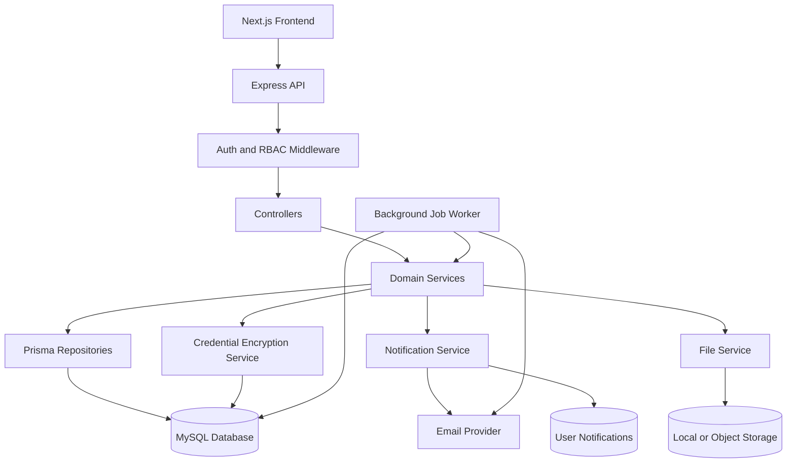
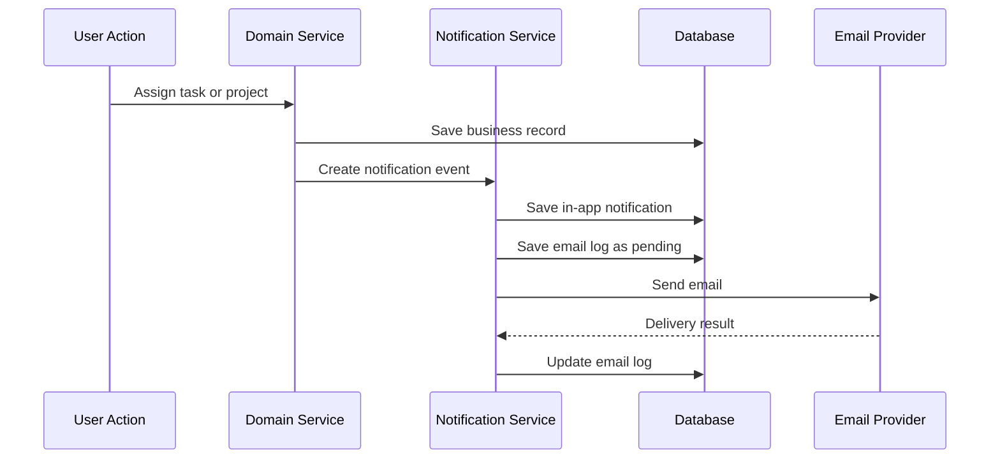
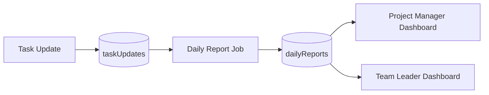
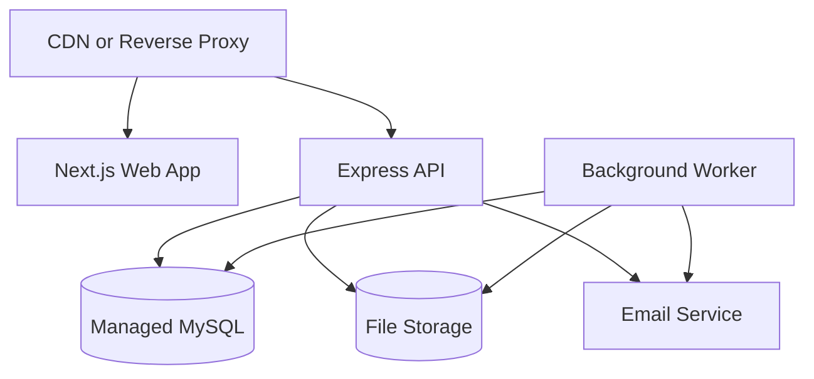

# Milestone 1: Product Scope and System Architecture

## Objective

Define the production-ready architecture for an enterprise Project Management System built for software development companies. This milestone establishes the product boundaries, system modules, user roles, technical architecture, backend structure, security baseline, and delivery assumptions that later milestones will use for database design, Prisma schema, APIs, dashboards, reports, and deployment.

## Target Product

The system is a SaaS-grade project management platform for software teams. It should support project planning, team assignment, milestones, sprints, tasks, subtasks, daily task updates, auto-generated reports, notifications, project costing, budget tracking, developer cost calculation, credentials management, dashboards, audit logs, calendar planning, and role-based access control.

The product should be designed for multiple companies or organizations in the future, even if the first implementation starts as a single-tenant deployment. This keeps the schema and services ready for SaaS growth without forcing unnecessary complexity in the first release.

## Primary Users

### Admin

Owns complete system administration.

Responsibilities:
- Manage users, roles, and permissions
- Manage clients and projects
- Manage developer rates
- View all costing and budget reports
- Manage system settings
- Review global activity and audit logs

### Project Manager

Owns project delivery, budget visibility, and team coordination.

Responsibilities:
- Create and manage projects
- Assign project teams
- Create milestones and sprints
- Monitor project budget, burned budget, and remaining budget
- Review generated daily reports
- Review blockers, delays, and project health
- Manage project documents and credentials

### Team Leader

Owns day-to-day execution for assigned teams.

Responsibilities:
- Manage assigned team members
- Create and assign tasks
- Review task progress and blockers
- Monitor overdue tasks
- Monitor sprint and milestone progress
- Review team updates

### Team Member

Owns individual task execution and daily task updates.

Responsibilities:
- View assigned projects and tasks
- Update task status and progress
- Add task comments
- Add work completed today
- Add plan for tomorrow
- Add blockers
- Upload task attachments
- Log task time where required

## Product Modules

The system will be divided into the following core modules:

| Module | Purpose |
| --- | --- |
| Authentication | Login, refresh tokens, password security, session lifecycle |
| RBAC | Roles, permissions, role-permission mapping, access checks |
| User Management | Users, profiles, developer profiles, availability |
| Client Management | Client records linked to projects |
| Project Management | Project metadata, budget, status, team, links, notes |
| Project Team | Project members, role in project, allocation, release tracking |
| Milestones | Project milestones, responsible users, due dates, progress |
| Sprints | Sprint planning, capacity, velocity, progress, sprint health |
| Tasks | Tasks, subtasks, dependencies, blockers, labels, workflow |
| Task Updates | Daily work updates captured from task activity |
| Time Logs | Hours worked for costing and billing calculations |
| Daily Reports | Auto-generated developer and project summaries |
| Comments | Task discussions, mentions, review notes |
| Attachments | Task and project files with validation |
| Credentials | Encrypted project credentials and sensitive access details |
| Notifications | In-app and email notifications with preferences |
| Background Jobs | Cron workers for reports, reminders, alerts, health updates |
| Costing | Developer cost, billing, budget utilization, profit/loss |
| Dashboards | Role-specific operational dashboards |
| Reports | Project, developer, team, and costing reports |
| Activity Logs | Audit trail for important system actions |
| Calendar | Project timelines, milestones, tasks, leave, meetings |
| Leave & Availability | Developer leave, holidays, capacity, workload planning |
| System Settings | Global settings, notification settings, security settings |

## Technical Stack

### Frontend

- Next.js
- React
- TypeScript
- Tailwind CSS
- Shadcn UI

Recommended frontend responsibilities:
- Server-side and client-side route handling
- Authenticated dashboard layouts
- Role-based navigation
- Data fetching from backend REST APIs
- Form validation and user feedback
- File upload UI
- Calendar, dashboard, and report views

### Backend

- Node.js
- Express.js
- TypeScript
- Prisma ORM

Recommended backend responsibilities:
- REST API layer
- Authentication and authorization
- Business logic services
- Database access through Prisma repositories
- Notification orchestration
- Background job execution
- File upload validation
- Credential encryption/decryption
- Activity logging

### Database

- MySQL
- Prisma-compatible string IDs using UUID or CUID-style values
- camelCase column names
- plural table names
- soft delete support using `deletedAt`

### Background Processing

Background jobs should run separately from the main API process in production. They may share the same codebase but should have a separate runtime entrypoint.

Job categories:
- Reminder jobs
- Report generation jobs
- Budget alert jobs
- Health calculation jobs
- Notification delivery jobs
- Email summary jobs

## System Architecture



## Backend Clean Architecture

Recommended backend structure:

```text
src/
  config/
  controllers/
  services/
  repositories/
  middlewares/
  validators/
  routes/
  utils/
  jobs/
  types/
  prisma/
```

### Layer Responsibilities

| Layer | Responsibility |
| --- | --- |
| routes | Bind HTTP routes to controllers and middleware |
| controllers | Parse request, call services, return response |
| services | Business rules and workflows |
| repositories | Database reads/writes through Prisma |
| validators | Request validation schemas |
| middlewares | Auth, RBAC, errors, rate limits, uploads |
| jobs | Cron/background job entrypoints |
| utils | Shared helpers such as encryption, dates, pagination |
| config | Environment, database, JWT, mail, storage config |
| types | Shared TypeScript types |
| prisma | Prisma client and schema |

## Frontend Architecture

Recommended frontend structure:

```text
src/
  app/
  components/
  features/
  hooks/
  lib/
  services/
  stores/
  types/
  styles/
```

### Frontend Principles

- Keep role-specific dashboard pages separate.
- Keep reusable UI components independent from business modules.
- Keep API client logic centralized.
- Use typed request and response DTOs.
- Use consistent loading, empty, success, and error states.
- Hide unauthorized actions in the UI, but always enforce permissions in the backend.

## Access Control Architecture

Access control has two layers:

1. System-level RBAC permission checks
2. Project-level membership checks

Example:
- `project.view` allows a user to view project records generally.
- Project membership decides whether the user can view a specific project.
- Admin can bypass project membership checks.
- Project Manager can access assigned projects.
- Team Leader and Team Member can access projects where they are members.

Permission examples:
- `project.create`
- `project.update`
- `project.delete`
- `project.view`
- `project.assignTeam`
- `project.viewBudget`
- `project.viewCosting`
- `task.create`
- `task.assign`
- `task.update`
- `task.view`
- `task.delete`
- `developerRate.manage`
- `report.view`
- `credential.view`
- `credential.manage`

## Data Ownership Rules

General ownership model:

- Admin can access all records.
- Project Manager can access projects assigned to them.
- Team Leader can access projects and tasks assigned to their team.
- Team Member can access assigned projects and assigned tasks.
- Sensitive project credentials require explicit credential permissions.
- Budget and costing data require explicit budget/costing permissions.

## Security Baseline

Required security controls:

- JWT access tokens
- Refresh token rotation
- Password hashing with a strong adaptive hash
- RBAC middleware
- Project membership middleware
- Input validation
- Centralized error handling
- Rate limiting
- Helmet security headers
- CORS allowlist
- Encrypted project credentials
- File upload validation
- Audit logs for important actions
- Secure environment variable handling

Sensitive fields such as server passwords, production credentials, API keys, database passwords, and private tokens must never be stored as plain text.

## Notification Architecture

Notification events should be created by domain services and delivered through notification workers where practical.

Notification flow:



## Costing Architecture

Costing must be calculated from time logs and historical developer rates.

Core rules:

- Developer cost must not be stored in `developerProfiles`.
- Rates live in `developerRates`.
- Time lives in `taskTimeLogs`.
- Cost is calculated using the developer rate effective on the work date.
- Old costs must remain accurate after future rate changes.

Formula examples:

```text
actualCost = taskTimeLogs.hoursWorked * developerRates.costPerHour
actualBilling = taskTimeLogs.hoursWorked * developerRates.billingRatePerHour
remainingBudget = projects.budget - actualCost
budgetUtilization = actualCost / projects.budget * 100
profitLoss = actualBilling - actualCost
```

## Daily Report Architecture

Team members should not submit separate daily reports manually. Daily reports are generated from task updates.

Flow:



A task update should capture:

- Work completed today
- Plan for tomorrow
- Blockers
- Progress percentage
- Status update
- Optional time spent

Generated reports should support:

- Developer-wise daily summary
- Project-wise daily summary
- Missing task updates
- Blockers raised today
- Tasks moved to review, testing, or completed
- Tasks with no update today

## Deployment Architecture

Recommended production deployment:



Production services:

- Web app process
- API process
- Background worker process
- MySQL database
- File storage
- Email provider
- Reverse proxy or load balancer

## Environment Configuration

Recommended environment groups:

- `DATABASE_URL`
- `JWT_ACCESS_SECRET`
- `JWT_REFRESH_SECRET`
- `ACCESS_TOKEN_TTL`
- `REFRESH_TOKEN_TTL`
- `CREDENTIAL_ENCRYPTION_KEY`
- `CORS_ALLOWED_ORIGINS`
- `EMAIL_HOST`
- `EMAIL_PORT`
- `EMAIL_USER`
- `EMAIL_PASSWORD`
- `STORAGE_DRIVER`
- `UPLOAD_MAX_SIZE_MB`

## Non-Functional Requirements

### Scalability

- Keep API stateless.
- Use separate worker processes for cron jobs.
- Add indexes for dashboard and report queries.
- Use pagination for list APIs.
- Avoid calculating expensive reports on every request.
- Cache dashboard summaries where needed.

### Reliability

- Use transactions for multi-table workflows.
- Record notification/email delivery status.
- Make background jobs idempotent.
- Use soft deletes for important business records.
- Keep audit logs immutable where practical.

### Maintainability

- Keep controller logic thin.
- Keep business rules in services.
- Keep Prisma access inside repositories.
- Use shared DTOs and validation schemas.
- Keep permission checks explicit and testable.

### Observability

- Log API errors.
- Log background job runs.
- Track email failures.
- Track authentication failures.
- Track important activity in `activityLogs`.

## Milestone 1 Completion Criteria

Milestone 1 is complete when the following are accepted:

- Product modules are defined.
- User roles and responsibilities are defined.
- Technical stack is fixed.
- Backend architecture is defined.
- Frontend architecture is defined.
- Security baseline is defined.
- Notification, costing, and daily report flows are defined.
- Deployment shape is defined.
- Later milestones can safely start database and Prisma design from this architecture.

## Next Milestone

Milestone 2 should produce the database foundation:

- Naming conventions
- Base table rules
- Core identity and RBAC tables
- User and developer profile tables
- Client table
- Developer rate history table
- Common indexes and constraints
- Initial Prisma model patterns
